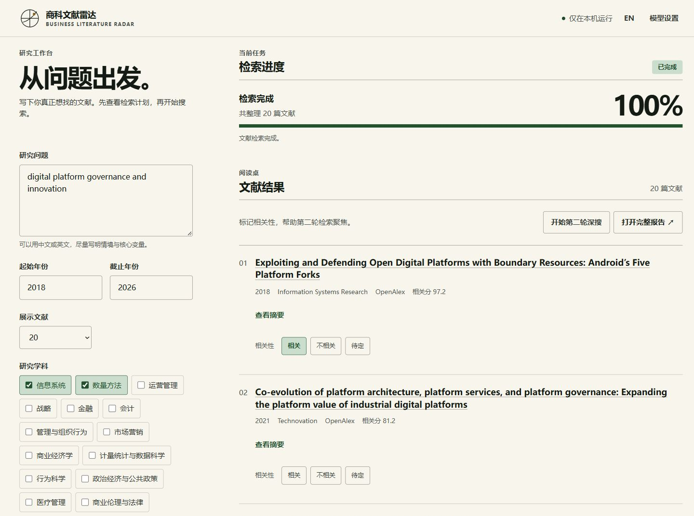

# 商科文献雷达

**Business Literature Radar** 是给商学院 PhD 和硕博研究者的本地文献工作台：把自然语言研究问题变成可编辑的检索计划，汇总公开论文元数据与摘要，进行相关性筛选，再用反馈开启第二轮深搜。它在你的电脑上启动双语网页，不需要注册本产品的账户。

[English README](README.en.md) · [隐私说明](docs/privacy.md) · [MIT License](LICENSE)



图为使用公开 OpenAlex 文献数据的实际运行界面；论文信息请以原始来源为准。

## 先选一种使用方式

| 使用方式 | 适合谁 | 模型从哪里来 |
|---|---|---|
| 本地网页 + 规则模式 | 先体验检索，不想配置模型 | 不调用 LLM；规划、排序和翻译能力有限 |
| 本地网页 + 自己的 API Key | 想在网页里规划、排序、翻译 | 自己的 OpenAI、Anthropic Claude 或兼容 API，按服务商计费 |
| 本地网页 + Codex CLI | 已在本机安装并登录 Codex 的用户 | 本机 Codex CLI；受账户资格与使用限制约束 |
| Codex / Claude Code 原生 Skill | 想在 Agent 内完成完整检索工作流 | Agent 自带模型处理规划、筛选与翻译；无需另填本产品的 API Key |

网页不会把作者的私人 Key 赠送给下载者，也不会把 Claude 订阅伪装成第三方网页的 API。Claude Pro/Max 等订阅用户可在 Claude Code 中使用原生 Skill；网页若选择 Claude，则需要你自己的 Claude API Key。[OpenAI 说明 ChatGPT 与 API 分开计费](https://help.openai.com/en/articles/9039756)；[Anthropic 说明第三方产品应使用 API Key](https://support.claude.com/en/articles/13189465-log-in-to-your-claude-account)。

## 下载与启动

### Windows：解压即用

1. 从 [Releases](https://github.com/Mat-Wong/business-literature-radar/releases) 下载最新的 `business-literature-radar-v*-windows.zip` 并解压到有写入权限的普通文件夹（不要直接放在 `Program Files`）。
2. 双击 `run.bat`。它会启动 `BusinessLiteratureRadar.exe` 并在默认浏览器打开本机网页。
3. 首次使用可保持“规则模式”，也可在设置中填自己的 API Key，或选择已经登录的 Codex CLI。
4. 输入研究问题，选择学科方向（自动匹配目标期刊）和年份；先看可编辑计划，再开始检索。

Windows 下载包自带 EXE，无需安装 Python。首次启动或网络请求时，系统防火墙和安全软件可能询问是否允许程序运行；本产品只需要连接公开学术元数据源以及你主动选择的 LLM 服务。不要把本机网页端口暴露到外网。

### macOS / Linux：源码运行

需要 Python 3.10+，无需额外运行时依赖：

```bash
git clone https://github.com/Mat-Wong/business-literature-radar.git
cd business-literature-radar
python3 app.py
```

也可以在已下载的源码目录执行 `sh run.sh`。Windows 源码用户运行 `python app.py` 或双击 `run.bat`。网页仅在 `127.0.0.1` 监听；控制台会显示打开地址。

## 一次检索怎么走

1. 用中文或英文描述问题，可补充纳入标准与排除条件。选择年份、结果上限和学科方向，系统据此匹配目标期刊；默认方向为 IS 与 QM。
2. 预览并修改检索计划，然后启动首轮检索。界面显示阶段、进度和日志；可以停止任务。
3. 阅读结果、来源链接与原始摘要。对首轮候选标记“相关 / 不相关 / 不确定”，再执行第二轮深搜。第二轮会根据反馈改写查询，并可沿相关论文的引用网络寻找额外候选。
4. 在结果页与导出的 HTML 报告中切换中文 / English。论文原始标题和摘要不被覆盖；启用翻译时，并列展示中文译文。缺失源摘要的论文会明确标注，模型不可用导致的翻译遗漏也会提示。
5. 打开程序所在目录的 `output/` 中的 HTML、Markdown、CSV 或 JSON 文件。第二轮会记录反馈和搜索审计。

进度百分比代表已完成的工作阶段，不是准确的剩余时间估计。停止时可能保留部分文件；只有报告成功生成才提示完成。关闭浏览器标签页并不会退出本机服务；请使用界面的“退出应用”按钮。

## 文献范围与可核验性

工具聚合 OpenAlex、Crossref、Semantic Scholar、arXiv、DBLP 和 SSRN 相关的公开元数据，按 DOI 等标识去重，并结合主题、年份及所选目标期刊排序。学科选择覆盖 IS、QM / Analytics、OM、Strategy、Finance、Accounting、Management / OB、Marketing、Business Economics、Econometrics / Statistics / Data Science、Behavioral Science、Political Economy / Public Policy、Health Care Management、Ethics & Legal Studies。arXiv、SSRN 和 CS/ML 仍作为跨学科线索保留。

这些来源的覆盖与摘要完整度不一致，个别服务会限流或拒绝请求。结果只是研究发现与初筛辅助，不保证查全，也不能代替数据库检索、人工复核或系统综述流程。目前不下载和解析 PDF 全文，也不绕过付费墙。

## 模型设置与成本

设置只需在本机填一次；配置保存在独立于作者个人版的 `BusinessLiteratureRadar` 用户目录。Key 不随 GitHub 源码或 Windows 下载包分发，也不会写入报告。具体位置、保护方式与数据流见[隐私说明](docs/privacy.md)。

- **OpenAI API**：在 [OpenAI API 平台](https://platform.openai.com/api-keys)创建自己的 Key；需确认 API 账户有可用额度。
- **Claude API**：在 [Claude Console](https://console.anthropic.com/settings/keys)创建自己的 Key。Claude 订阅不等于 Claude API 额度。
- **兼容 API**：填写服务商提供的完整 HTTPS endpoint、模型名和 Key；只对你信任的服务商发送研究内容。
- **Codex CLI**：先按 [Codex 非交互模式说明](https://learn.chatgpt.com/docs/non-interactive-mode)在本机安装、登录并验证 CLI。网页只调用本机 CLI，不读取其登录凭据。CLI 的可用模型与限制由你的账户决定。
- **OpenCode / Gemini CLI**：保留为高级本机 CLI 选项，需你自己安装并登录；不同版本兼容性可能有差异。
- **规则模式**：不调用 LLM，适合无需 Key 的基础检索；不会凭空生成中文翻译。

启用翻译时，工具会尝试为所有最终展示论文生成中文标题与摘要，并在一个模型失败时尝试已配置的备用模型。服务商限额、超时或源数据缺失仍可能使个别译文不可用；界面与报告会标明状态。长时间深搜与全量翻译可能产生明显 API 成本，请先设置服务商的消费上限。

## Codex 与 Claude Code Skills

仓库同时包含：

```text
.agents/skills/business-literature-radar/   # Codex
.claude/skills/business-literature-radar/    # Claude Code
```

在 Codex 或 Claude Code 中打开该项目，明确提出“使用 business-literature-radar Skill 检索……”。Skill 调用同一套本地检索引擎，Agent 自身负责规划、筛选、翻译与报告整理，因此无需在本产品中填写 API Key。Windows 下载包自带可供 Skill 调用的引擎 EXE；macOS/Linux 使用 Python 源码。Codex 和 Claude Code 的使用受各自账户、客户端与模型限制约束；Skill 不承诺免除订阅费或无限额度。原生 Skill 的安装机制可参考 [Codex Skills](https://learn.chatgpt.com/docs/build-skills) 与 [Claude Code Skills](https://code.claude.com/docs/en/skills)。

Skill 的翻译桥接会把最终论文分成可核对的小批次；只有每篇均有译文时，才另外生成 `-agent` 版本的 HTML/Markdown/CSV/JSON 报告，原始检索报告保留不变。

## 项目结构

```text
app.py                 本地网页服务与任务控制
web/                   双语界面
search_papers.py       首轮检索与报告生成
search_v2.py           反馈驱动的第二轮检索
agent_bridge.py        原生 Skill 与引擎之间的工作流桥接
app_settings.py        本机用户设置
.agents/skills/         Codex Skill
.claude/skills/         Claude Code Skill
run.bat / run.sh       启动入口
build_windows.ps1      Windows 打包脚本
```

源码仅依赖 Python 标准库；Windows 打包使用 PyInstaller。开发者可先运行不联网自检：

```bash
python search_papers.py --self-test
```

Windows 打包及自动发布说明见[构建文档](docs/build.md)。

## 问题反馈与许可

欢迎在 [GitHub Issues](https://github.com/Mat-Wong/business-literature-radar/issues) 报告问题或建议。请附 Python/Windows 版本、可公开的错误信息和复现步骤，不要粘贴 API Key、个人研究数据或本机配置文件。代码以 [MIT License](LICENSE) 发布。Mat-Wong 制作与维护。
